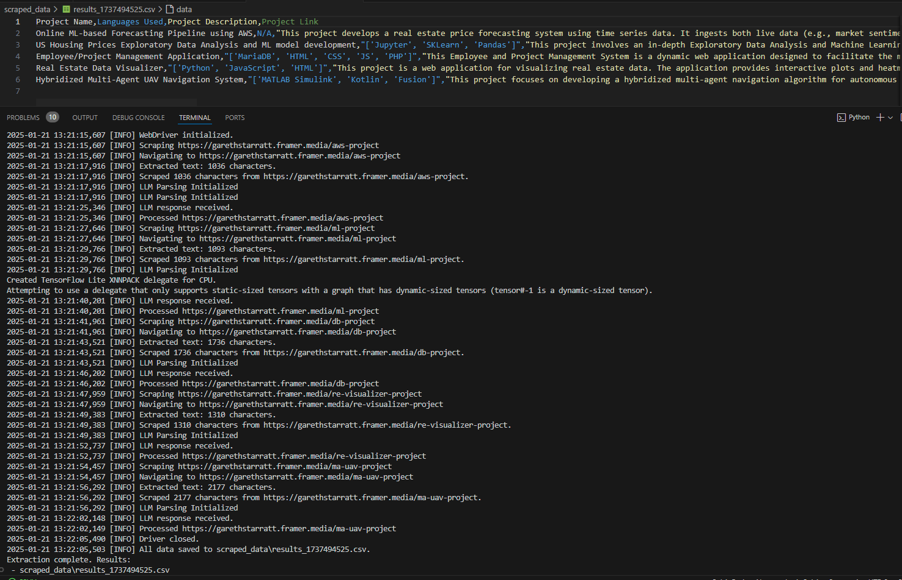

**autoScraper** is a versatile and resilient web scraping tool designed to allow for automation and scaling of web scraping jobs. Leveraging Selenium for browser 
automation and gpt-4o for cost-effective and scalable data processing, autoScraper automatically cleans and formats the extracted data for easy analysis.

## Features

- **Multi-URL Scraping:** Extract any number of features from multiple websites simultaneously.
- **Custom Instructions:** Define specific guidelines for data extraction or cleaning based on your application.
- **Data Validation:** Ensure extracted data contains required fields for consistency.
- **Resilient and Scalable:** Consistently generate clean, standard data without need to maintenence during UI changes. 
- **Standardized Naming:** Optionally provide a list of standardized product/catagory names for uniformity.
- **Fast deployment:** Deployment requires minimal web scraping knowledge and can be configured in minutes.  

**Disclaimer:** autoScraper is intended for educational purposes only. Users should ensure they have the right to scrape the target websites and comply with all applicable
regulations and the websites' terms of service. Do not misuse autoScraper for unauthorized data extraction or activities that violate privacy, ToS, or Ethics. 
Continually, redistribution of proprietary data gathered through web scraping for monitary gain, even if publically available, is strictly illegal. 
 

## Installation

1. **Clone the Repository:**
   git clone https://github.com/DOGBALLGNOSIS/autoScraper.git

2: **Install Dependencies:**
    pip install -r requirements.txt

3: **Config OpenAI API Key:**
    set OPENAI_API_KEY=your_openai_api_key_here

A demonstration of how to call the microservice can be found at client.py.
The results of the sample execution can be seen below:

